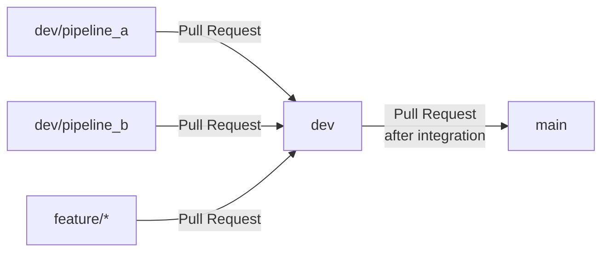

# Contributing Guide

## Branch Flow



| branch         | desc                                                                                   |
| -------------- | -------------------------------------------------------------------------------------- |
| main           | 正式且穩定的主分支。                                                                   |
| dev            | 整合各功能分支的開發分支。                                                             |
| other branches | 個人功能、資料管線或修正分支，例如 `dev/pipeline_a`、`dev/pipeline_b` 或 `feature/*`。 |

原則上不要直接在 `main` 或 `dev` 上開發，也不能直接 push 到這兩個受保護分支。

## Getting Started

先同步最新的 `dev`：

```powershell
git fetch origin --prune
git switch dev
git pull --ff-only origin dev
git switch -c dev/<your-branch-name>
```

例如：

```powershell
git switch -c dev/pipeline_a
```

分支名稱建議使用小寫英文、數字與連字號或斜線，例如：

```text
dev/pipeline_a
dev/pipeline_b
dev/fix_missing
```

## Validation Before Commit

在 commit 和 push 前，請先依照 `README.md` 完成本地 `Ruff` 與 `Pyright` 驗證，確保程式碼符合規範。如果檢查失敗，請先修正問題，再重新執行檢查。

## Commit message

Commit message 建議使用以下格式：

```text
<type>: <short description>
```

常用的 `type`：

| Type       | 用途             |
| ---------- | ---------------- |
| `feat`     | 新增功能         |
| `fix`      | 修正錯誤         |
| `docs`     | 文件修改         |
| `test`     | 測試或測試流程   |
| `ci`       | CI/CD 設定       |
| `refactor` | 不改變功能的重構 |
| `chore`    | 一般維護         |
| `minor`    | 小幅修改或微調   |

範例：

```text
feat: add training pipeline configuration
fix: validate missing oracle settings
test: verify dev branch protection workflow
docs: update contributing guide
```

請使用簡短、清楚、動詞開頭的描述，例如 `add`、`fix`、`update`、`remove`。

## Create Pull Request

將功能分支推送到遠端：

```powershell
git push -u origin dev/<your-branch-name>
```

- 功能分支 PR 的目標分支是 `dev`。
- 只有完成整合並準備發布的內容，才建立 `dev` 到 `main` 的 PR。
- 使用 Repo 提供的 PR Template，完整填寫 Description、Implementation details、Change Type、Impact Scope 與 Validation。
- 如果有相關 Issue，請在 Related Issue 中連結；沒有則填寫 `None`。
- 只有真正完成的檢查才勾選 Validation 項目。

## Merge Pull Request

使用 **GitHub Rulesets** 保護 `dev` 與 `main`。PR 建立或更新後，GitHub Actions 會執行 `Quality Check`。

### Rulesets

- **Require a pull request before merging**：禁止直接 push 到受保護分支，所有變更都必須透過 PR 合併。
- **Required approvals (1)**：至少需要 1 位具有 Write 以上權限的協作者核准。
- **Dismiss stale pull request approvals when new commits are pushed**：PR 新增可審查的 commit 後，先前的 approval 會失效，需要重新審查。
- **Require conversation resolution before merging**：所有 inline review conversation 必須先解決，才能合併。
- **Require status checks to pass**：指定的 GitHub Actions 檢查必須成功；目前 required check 是 `Quality Check`。
- **Require branches to be up to date before merging**：PR 分支必須先包含目標分支最新內容，並以最新內容重新通過 CI。
- **Block force pushes**：禁止對受保護分支使用 force push，避免重寫共享歷史。
- **Restrict deletions**：禁止刪除受保護的 `dev` 與 `main` 分支。
- **Allowed merge methods: Merge commits**：目前使用 merge commit 保留 PR 的整合紀錄。

以上設定會套用到各自的目標分支：

- `protect-dev`：Target branch 是 `dev`，功能分支 PR 必須先合併到 `dev`。
- `protect-main`：Target branch 是 `main`，整合完成的 `dev` 再透過 PR 合併到 `main`。

PR 必須符合上述條件，才能進行合併。

## Conflict Resolution

若 `dev` 在 PR 期間有新變更，先更新本地 `dev`：

```powershell
git fetch origin --prune
git switch dev
git pull --ff-only origin dev
```

再回到自己的功能分支並合併最新 `dev`：

```powershell
git switch dev/<your-branch-name>
git merge dev
```

解決衝突後：

```powershell
git add <resolved-files>
git commit
git push
```

Push 新 commit 後，CI 會重新執行；原有 approval 可能需要重新取得。

## After Merge

合併完成後，GitHub 會自動刪除一般功能分支。受保護的 `dev` 與 `main` 不會因此被刪除。

本地端同步並清理遠端追蹤資訊：

```powershell
git fetch origin --prune
git switch dev
git pull --ff-only origin dev
```

若本地仍保留已合併的功能分支，可以刪除：

```powershell
git branch -d dev/<your-branch-name>
```

## Review PR

不要直接把別人的 PR 混入自己的開發分支。需要在地端試跑時，可以建立獨立的 review branch：

```powershell
git fetch origin pull/<PR-number>/head:review/pr-<PR-number>
git switch review/pr-<PR-number>
```

完成測試後切回自己的分支：

```powershell
git switch dev/<your-branch-name>
```

Review branch 不需要 push；PR 的意見與核准請直接在 GitHub 上提交。
