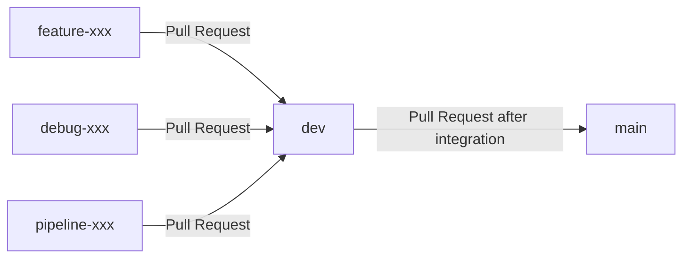

# Contributing Guide

## Branch Flow

所有開發 branch 都應先透過 Pull Request 合併到 `dev`；整合完成後，再由 `dev` 透過 Pull Request 合併到 `main`。



| Branch      | 用途                                  |
| ----------- | ------------------------------------- |
| `main`      | 穩定版本與正式發布使用的主要 branch。 |
| `dev`       | 整合各項開發內容的主要 branch。       |
| `<purpose>` | 以 `dev` 為基礎建立的開發 branch。    |

由於 repository 已經存在 `dev` branch，不可使用 `dev/<branch-name>` 格式，例如 `dev/xxx`。Git 會將 `dev` 視為既有的 ref，因而無法再建立其下的 branch。

## Getting Started

先取得遠端最新狀態，再從 `dev` 建立工作 branch：

```powershell
git fetch origin --prune
git switch dev
git pull --ff-only origin dev
git switch -c dev-<purpose>
```

## Validation Before Commit

在 commit 和 push 前，請依照專案 `README.md` 的說明執行驗證。至少確認程式碼格式、lint 與型別檢查通過。

## Commit Message

Commit message 使用以下格式：

```text
<type>: <short description>
```

常用的 `type` 如下：

| Type       | 用途                           |
| ---------- | ------------------------------ |
| `feat`     | 新增功能                       |
| `fix`      | 修正錯誤                       |
| `docs`     | 文件變更                       |
| `test`     | 新增或修改測試                 |
| `ci`       | CI/CD 設定變更                 |
| `refactor` | 重構，不改變外部行為           |
| `chore`    | 維護性工作                     |
| `minor`    | 小幅變更，通常不影響功能或行為 |

Commit message 應簡潔描述實際變更，並以動詞開頭，例如 `add`、`fix`、`update` 或 `remove`。

```text
feat: add training pipeline configuration
fix: validate missing oracle settings
test: verify dev branch protection workflow
docs: update contributing guide
```

## Create Pull Request

完成修改並通過驗證後，推送工作 branch：

```powershell
git push -u origin <your-branch-name>
```

接著在 GitHub 建立 Pull Request：

- 開發 branch 的目標 branch 應為 `dev`。
- `dev` 整合完成後，才建立以 `main` 為目標的 Pull Request。
- 請填寫 PR template，包括變更說明、實作細節、變更類型、影響範圍與驗證方式。
- 若沒有對應 Issue，請在 Related Issue 欄位填寫 `None`。
- 建立 PR 前，確認所有必要的 Validation 已完成。

## Merge Pull Request

使用 **GitHub Rulesets** 保護 `dev` 與 `main`。PR 建立或更新後，GitHub Actions 會執行 `Quality Check`。

### Rulesets

- **Require a pull request before merging**：禁止直接 push 到受保護分支，所有變更都必須透過 PR 合併。
- **Required approvals (1)**：至少需要 1 位具有 Write 以上權限的協作者核准。
- **Dismiss stale pull request approvals when new commits are pushed**：PR 新增可審查的 commit 後，先前的 approval 會失效，需要重新審查。
- **Require conversation resolution before merging**：所有 inline review conversation 必須先解決，才能合併。
- **Require status checks to pass**：指定的 GitHub Actions 檢查必須成功；目前 required check 是 `Quality Check`。
- **Require branches to be up to date before merging**：PR 分支必須先包含目標分支最新內容，並以最新內容重新通過 CI。
- **Block force pushes**：禁止對受保護分支使用 force push，避免重寫共享歷史。
- **Restrict deletions**：禁止刪除受保護的 `dev` 與 `main` 分支。
- **Allowed merge methods: Merge commits**：目前使用 merge commit 保留 PR 的整合紀錄。

以上設定會套用到各自的目標分支：

- `protect-dev`：Target branch 是 `dev`，功能分支 PR 必須先合併到 `dev`。
- `protect-main`：Target branch 是 `main`，整合完成的 `dev` 再透過 PR 合併到 `main`。

PR 必須符合上述條件，才能進行合併。

## Conflict Resolution

如果 PR 發生 conflict，先更新本地的 `dev`：

```powershell
git fetch origin --prune
git switch dev
git pull --ff-only origin dev
```

切回你的工作 branch，合併最新的 `dev`：

```powershell
git switch <your-branch-name>
git merge dev
```

解決衝突後，確認檔案內容並提交：

```powershell
git add <resolved-files>
git commit
git push
```

Push 後請等待 CI 檢查完成，必要時重新取得 reviewer approval。

## After Merge

PR 合併後，更新本地 branch：

```powershell
git fetch origin --prune
git switch dev
git pull --ff-only origin dev
```

工作 branch 已經合併且不再使用時，可以刪除本地 branch：

```powershell
git branch -d <your-branch-name>
```

若 Git 判斷 branch 尚未合併，請先確認內容確實已合併，再視需要使用 `-D`。

## Review PR

如需在本地檢查尚未合併的 PR，可以建立 review branch：

```powershell
git fetch origin pull/<PR-number>/head:review/pr-<PR-number>
git switch review/pr-<PR-number>
```

Review 完成後切回自己的工作 branch：

```powershell
git switch <your-branch-name>
```

Review branch 不應直接 push；請在 GitHub 的 Pull Request 介面提交 review 結果。
